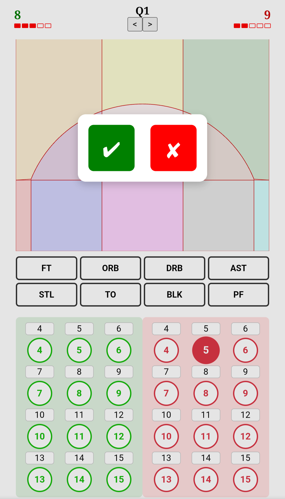
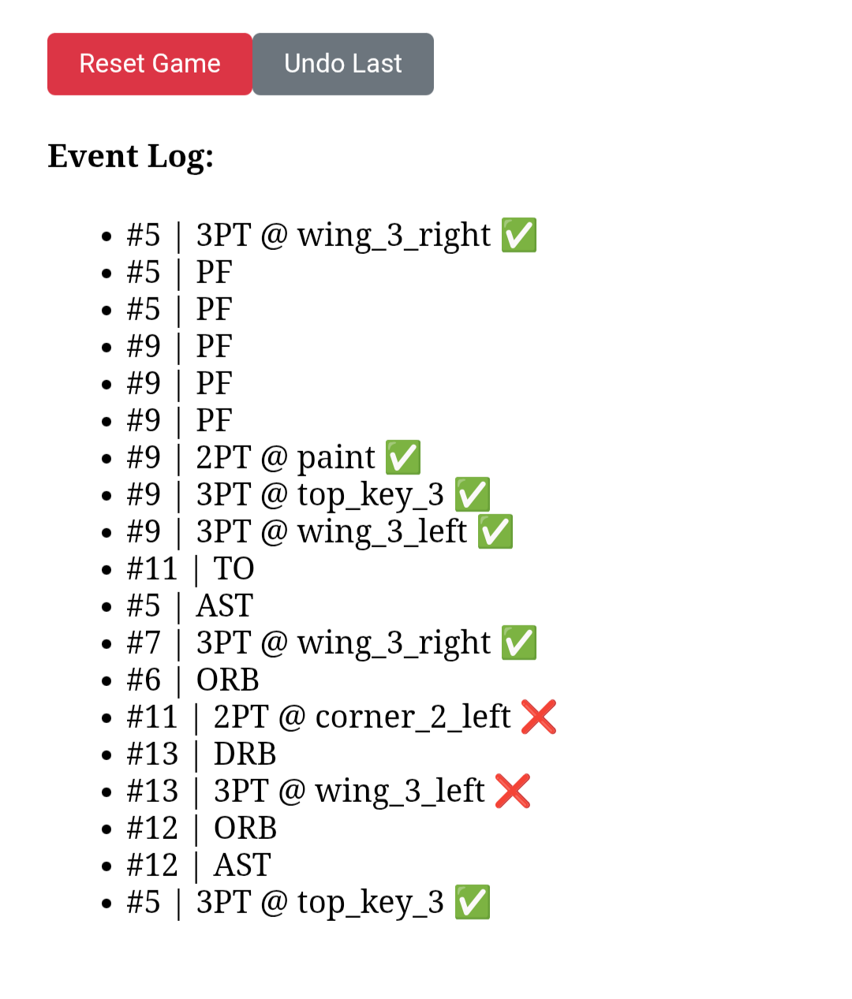
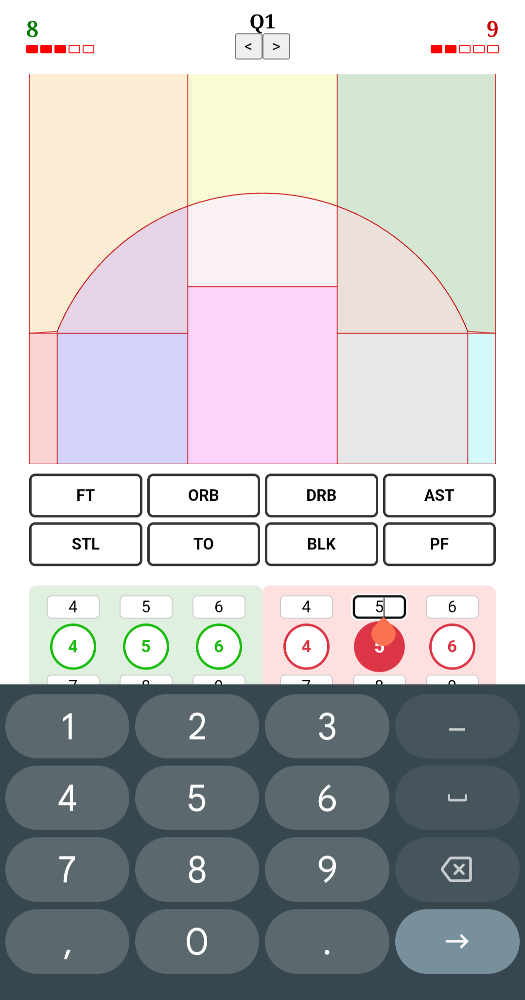

# 🏀 SnapStats

**SnapStats** is a minimalist, fast, and mobile-friendly basketball stat tracking web app built with Vite + React.  
It empowers parents, youth coaches, and team staff to track stats in real-time without losing focus on the game.

Designed for **speed**, **clarity**, and **offline-first usage**, SnapStats prioritizes *essential* stats and easy interaction — ideal for youth leagues, training sessions, and grassroots competitions.

Visit the live version (via gh-pages): https://wiubiki.github.io/snapstats

---

## 🚀 Features (v1.0)

- 📍 **Interactive SVG half-court** for zone-based shot tracking
- 👕 **Dual team player grids** (Home & Away)
- 📊 **Stat selector interface** for common basketball events
- ✅ **Quick modal for made/miss input** (FT & FG shots)
- 🕹 **Undo last action** + reset game control
- 🧠 **Event log viewer**, newest-first order
- 📱 **Mobile-first layout** — compact, single-viewport interface
- 💾 **LocalStorage-based data handling** (no cloud required)
- 🌐 **GitHub Pages deployment** for live testing and usage

---

## 🛠 Tech Stack

- **Vite + React**: fast builds, modern tooling
- **SVG**: custom-drawn interactive half-court with 11 pre-defined shot zones
- **LocalStorage**: persistent event data across sessions
- **Custom CSS** (Tailwind planned for future)
- **GitHub Pages**: for zero-config hosting

---

## 🧪 Coming Soon

> Tracked in `snapstats_future.md`

- 🧮 Team & player config editor (with saved settings)
- 🎨 Team color theming (score, UI tints, jerseys)
- 📤 Data export (CSV or JSON)
- 🏁 Game state save/load
- 📱 PWA support for installable app
- 📚 Post-game stats reports, shot maps & breakdowns

---

## 🧑‍💻 Getting Started (Local Dev)

```bash
npm install
npm run dev
```
Open http://localhost:5173 in your browser

---

## 📦 Build & Deploy (GH Pages)

```bash 
npm run build
npm run deploy
```

Live version (via gh-pages): https://wiubiki.github.io/snapstats

---

## Screenshots

###  Mobile Layout (Full Court in View)


###  Shot Modal (Made/Miss)


###  Event log for logged stats


###  Edit player numbers


---

## 🏗  Development Philosophy 

- Field-tested, not feature-bloated: Designed with real-world youth games in mind
- Data-informed: Logs what matters most for post-game insight
- Community-rooted: Inspired by real gaps in youth basketball stat tracking tools

---

Built with ❤️ and 🏀 by Aristeidis — powered by caffeine, live testing, and a love of clean UX.

